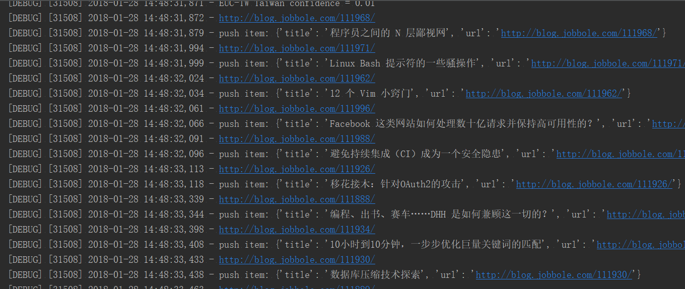
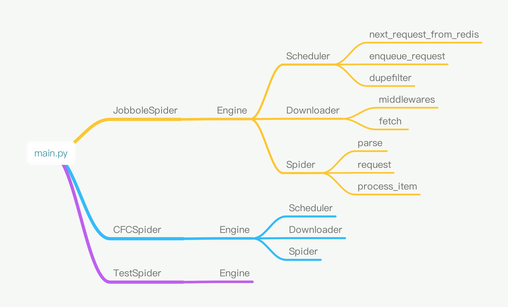

mini_spider = asyncio + 分布式
===========================
基于 asyncio 实现迷你 scrapy 分布式爬虫: 欢迎Star，千万别滥用公共配置，谢谢。
****
### QQ:290484002
### [我的博客](http://blog.csdn.net/shaququ/article/category/7042918)
****
## Requirements
* aiohttp (2.3.9)
* lxml (4.1.1)
* parsel (1.3.1)
* pymongo (3.6.0)
* redis (2.10.6)
* six (1.11.0)
* w3lib (1.18.0)
## Installation
    https://github.com/xueleilei120/mini_spider.git
## Usage

1. Write maim.py:

```python
from spiders.jobbole_spider import JobboleSpider
from spiders.cfc_spider import CFCSpider

if __name__ == "__main__":
    jobbole_spider = JobboleSpider()
    jobbole_spider.start()
```
2. Run `python main.py`

3. Result:



## Flow

